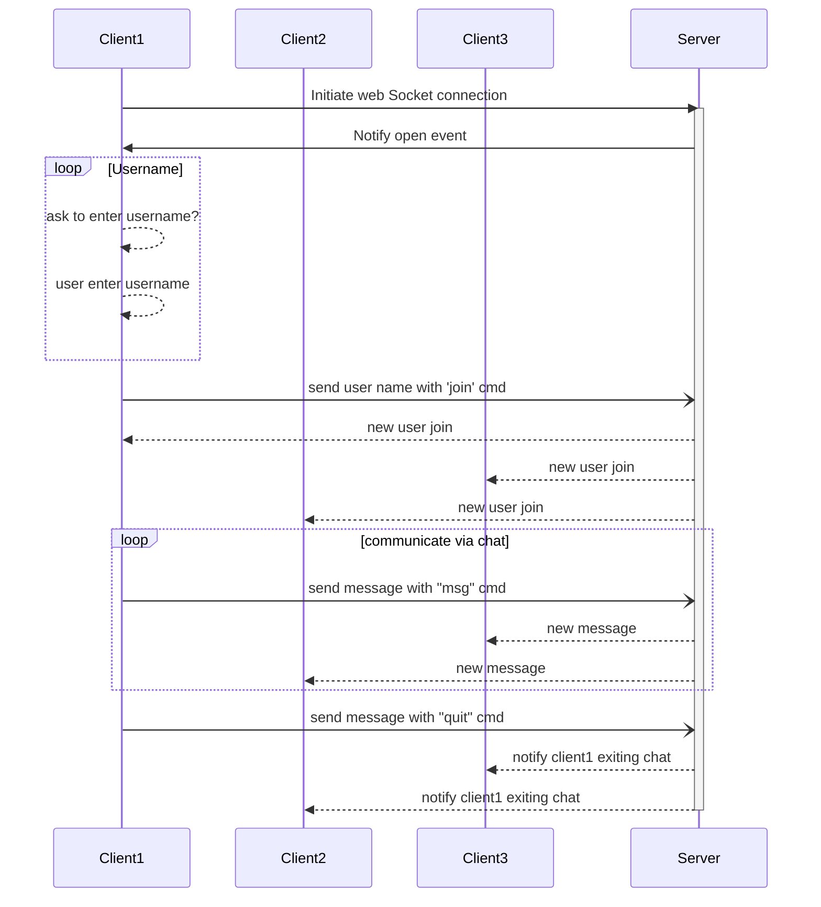

### Process

- client( browser) make a connection with server and establish websocket connection
- client was notified wesocket open event.
- web app: ask user to provide username to complete join chat
- once user enter the username web app send info with a commond "join".
- Server: look at the message
  - if "join": broadcast all client that the user new user join
  - if "msg": broadcast the message
  - if "quit": broadcast that user exiting chat and remove him from activ clients

